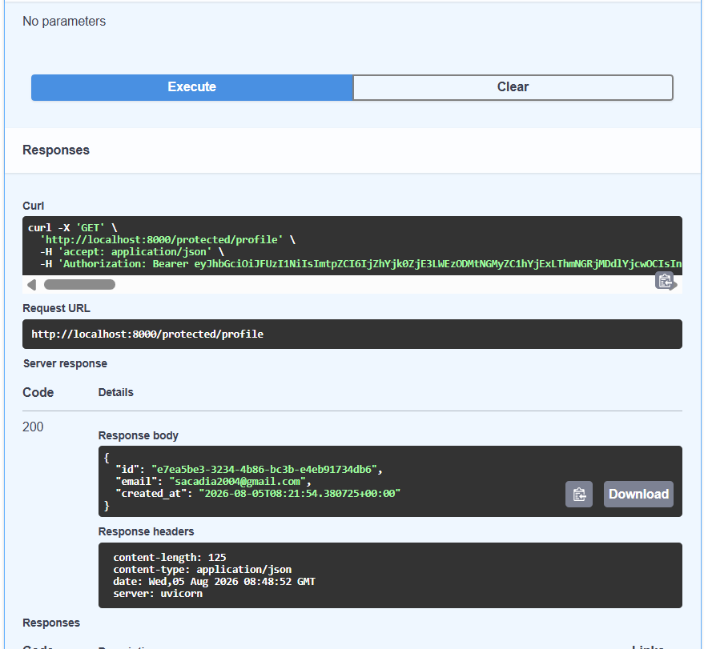

# Task API (CRUD + Postgres + Supabase Auth, Dockerized)

## W4·A3 update: Auth — Login & Protect

This version (W4·A3) adds authentication via **Supabase Auth**. Sign up,
log in, log out, and two protected routes now sit alongside the existing
task CRUD endpoints — all still running in Docker via `docker compose up`.

### Setup

1. Create a free project at [supabase.com](https://supabase.com).
2. From **Project Settings → API**, copy your **Project URL** and
   **anon/public key**.
3. Copy `.env.example` to `.env` and fill in `SUPABASE_URL`, `SUPABASE_KEY`
   (and keep the existing `DATABASE_URL` line).
4. `docker compose up --build`

App: `http://localhost:8000/docs`.

### API reference

| Method | Path                   | Auth required | Description                          |
|--------|------------------------|:--------------:|---------------------------------------|
| POST   | `/auth/signup`         | No             | Create a new user account (201)       |
| POST   | `/auth/login`          | No             | Log in, returns access + refresh JWT (200) |
| POST   | `/auth/logout`         | Yes            | Ends the current session (204)        |
| GET    | `/public/info`         | No             | Public info, no token needed (200)    |
| GET    | `/protected/profile`   | Yes            | Returns the logged-in user's id/email/created_at (200/401) |
| GET    | `/protected/dashboard` | Yes            | Second protected route, proves the auth dependency is reusable (200/401) |
| GET    | `/tasks`               | No             | List all tasks                        |
| GET    | `/tasks/{id}`          | No             | Get a single task                     |
| POST   | `/tasks`               | No             | Create a task                         |
| PUT    | `/tasks/{id}`          | No             | Update a task                         |
| DELETE | `/tasks/{id}`          | No             | Delete a task                         |

Protected routes expect `Authorization: Bearer <access_token>`. Missing,
malformed, or invalid/expired tokens all return `401` with a JSON
`{"detail": "..."}` body. Missing/empty email or password on
signup/login returns `400`.

### How auth is wired

- `supabase_client.py` builds one shared Supabase client from
  `SUPABASE_URL`/`SUPABASE_KEY` in `.env`.
- `auth.py` holds a single reusable dependency, `get_current_user()`,
  built on FastAPI's `HTTPBearer` security scheme. It reads the bearer
  token, calls `supabase.auth.get_user(token)` to verify it, and raises
  `401` if it's missing or invalid. Any route that adds
  `Depends(get_current_user)` becomes protected — `/protected/profile`,
  `/protected/dashboard`, and `/auth/logout` all just add that one
  dependency rather than repeating token-checking code.
- Using `HTTPBearer` also makes FastAPI auto-generate the Swagger
  security scheme, so `/docs` shows padlock icons on protected routes
  and a working "Authorize" button with no extra config.

### Swagger UI

`/docs` shows padlock icons next to protected routes. Clicking
**Authorize** and pasting a valid access token lets you call
`/protected/profile` directly from the browser:



### Verified checkpoints (real output from my own test run)

**Signup + login:**
```
POST /auth/signup -> 201 Created
POST /auth/login  -> 200 OK, returns access_token + refresh_token + user
```

**Public vs protected, no token:**
```
GET /public/info          -> 200 OK
GET /protected/profile    -> 401 {"detail":"Access token required"}
```

**Protected route with a valid token, then a tampered one:**
```
GET /protected/profile -H "Authorization: Bearer <valid token>"   -> 200 OK, real user id/email/created_at
GET /protected/profile -H "Authorization: Bearer <valid token>x"  -> 401 {"detail":"Invalid or expired token"}
```

**Dependency reused on a second route** (`/protected/dashboard`), same
pass/fail behavior as `/protected/profile` — confirming the auth check
lives in one place (`auth.py`), not copy-pasted per route.

**Logout:**
```
POST /auth/logout -H "Authorization: Bearer <token>" -> 204 No Content
```

### Security note

`.env` (holding the real Supabase keys) is gitignored and was never
committed — verified with `git status` before every commit in this repo.
`token.txt` and `login_response.json`, used locally to store JWTs while
testing with curl, are gitignored too.

---


This version (W3·A3) replaces SQLite with Postgres, running in Docker
alongside the app via `docker compose up`.

**Only `database.py` changed.** `main.py` and every route are byte-for-byte
identical to the SQLite version — same function names
(`get_all_tasks()`, `insert_task()`, etc.), same request/response shapes.
That's the point of keeping SQL isolated behind a small set of functions:
swapping the storage engine is a one-file change.

### Run it

```
cp .env.example .env      # only needed once
docker compose up --build
```

App: `http://localhost:8000/docs`. Postgres data lives in a named Docker
volume (`pgdata`), so it survives container restarts.

### Persistence check (how I verified it)

1. Created a task via `POST /tasks`.
2. Ran `docker compose down` (stops both containers).
3. Ran `docker compose up` again (no `--build`, no fresh volume).
4. `GET /tasks` still showed the task I created in step 1 — confirming data
   survives an app + container restart, not just a Python process restart.

---

# Task API (CRUD + SQLite) — original W3·A1 version below

A small CRUD API for managing a to-do list, built with FastAPI.
Originally built for W2·A1 (in-memory storage). This version (W3·A1)
replaces the in-memory list with a real SQLite database, so data now
survives server restarts. The API itself — routes, request bodies,
response shapes, status codes — is unchanged.

## Install & run

```
pip install fastapi uvicorn
uvicorn main:app --reload --port 8000
```

The server starts at `http://localhost:8000`.

On first run, it automatically creates `tasks.db` in the project folder,
creates the `tasks` table, and seeds 3 example tasks. On every later run,
it reuses the existing database and skips seeding.

## Endpoints

| Method | Path            | Description                          |
|--------|-----------------|---------------------------------------|
| GET    | `/`             | Basic info about this API            |
| GET    | `/health`       | Health check                          |
| GET    | `/tasks`        | List all tasks                        |
| GET    | `/tasks/{id}`   | Get a single task by id                |
| POST   | `/tasks`        | Create a new task                     |
| PUT    | `/tasks/{id}`   | Update a task's title and/or done     |
| DELETE | `/tasks/{id}`   | Delete a task by id                   |

## Why SQLite

SQLite needs no separate database server — it's a single file (`tasks.db`)
that Python's built-in `sqlite3` module reads and writes directly. That
makes it the simplest way to add real persistence to a small project like
this one, with zero extra installation or configuration. The same SQL used
here (`CREATE TABLE`, `SELECT`, `INSERT`, `UPDATE`, `DELETE`) carries over
almost unchanged if this project later moves to PostgreSQL or MySQL.

## Where the database lives

`tasks.db` is created in the project root, next to `main.py`. It's listed
in `.gitignore` and is not committed to the repository — each clone
generates its own copy automatically the first time it runs.

## Database layer

All SQL lives in `database.py`. `main.py` never touches SQL directly — it
calls plain functions like `get_all_tasks()`, `insert_task()`, and
`update_task()`, which keeps the API layer and the storage layer cleanly
separated.

## Example SQL query

```sql
SELECT * FROM tasks WHERE done = 1;
```

Run directly against `tasks.db` in a SQLite viewer, this returns only the
completed tasks — and the API's `GET /tasks` reflects the same data
immediately, since both read from the same file.

## Database viewer screenshot

<!-- TODO: open tasks.db in DB Browser for SQLite, take a screenshot, save
     it as db-screenshot.png in this folder, then uncomment the line below -->
<!--  -->

## Example: curl -i output

```
curl.exe --% -i -X PUT http://localhost:8000/tasks/1 -H "Content-Type: application/json" -d "{\"done\":true}"

HTTP/1.1 200 OK
date: Tue, 14 Jul 2026 03:29:44 GMT
server: uvicorn
content-length: 44
content-type: application/json
{"id":1,"title":"Buy groceries","done":true}
```

## Swagger UI

Interactive docs at `http://localhost:8000/docs`. Screenshots below show a
successful `POST /tasks` and `GET /tasks` via "Try it out":


## From in-memory to SQLite

In W2·A1, data lived only in a Python list, so restarting the server reset
everything back to the 3 example tasks. In W3·A1, the same list is now a
`tasks` table in `tasks.db`. I verified persistence by creating a task,
killing the running server process, and restarting it — the new task was
still there, and no duplicate seed data was inserted, confirming the
"insert seed data only if empty" check works correctly.
